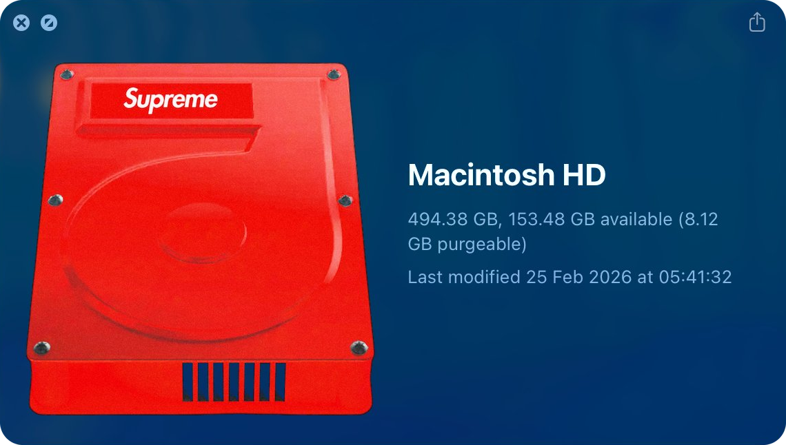

<div align="center">
  <br />
  
  <br /><br />
  <h3>luxury hard drive</h3>
  <p><em>custom macos drive icon for</em> <code>Macintosh HD</code></p>
  <br />
  <p>
    artwork by <a href="https://x.com/notbylght"><strong>notbylght</strong></a>
    &nbsp;&middot;&nbsp;
    <a href="https://zora.co/collect/zora:0x07b72045a5997e51ef4f701cd06542ef1cdc7536/107?referrer=0x5d2B7f517EA0C3a68E58C32f97b2B2c080ea3d6F">collect on zora</a>
  </p>
  <br />
</div>

## apply to `Macintosh HD`

```sh
sudo cp DriveIcon.icns /System/Volumes/Data/.VolumeIcon.icns
sudo chflags hidden /System/Volumes/Data/.VolumeIcon.icns
sudo SetFile -a C /System/Volumes/Data/.VolumeIcon.icns
sudo SetFile -a C /System/Volumes/Data
```

if finder does not refresh immediately, log out and back in or restart finder.
